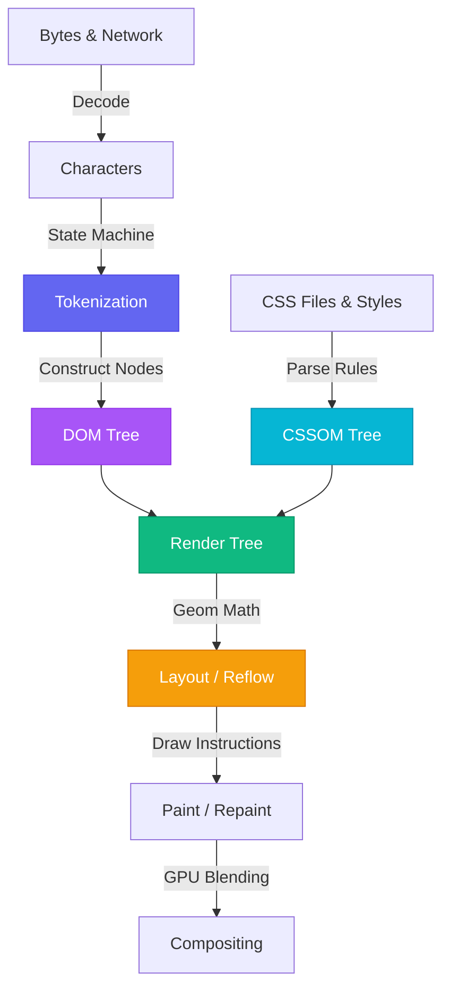

# 🪐 Aura Task Manager & DOM Playground

A premium, fully interactive Task Manager and Browser Rendering Explorer built strictly with **Vanilla HTML, CSS, and JavaScript**. 

This application serves as a visual playground and documentation sheet for core browser rendering pipelines, DOM manipulation techniques, property-attribute divergence, and event propagation dynamics.

---

## 🚀 Key Features

1. **Interactive Kanban Dashboard**:
   - Create, edit, complete, delete, star, and re-order tasks.
   - Live category color coding using data attributes (`data-category`).
   - Dynamic search bar and category filtering tabs.
   - Status counters detailing total, pending, and completed tasks.
   
2. **Attributes vs Properties Sandbox**:
   - Real-time comparison widget showing how the browser manages `input.value` (DOM property) independently of `input.getAttribute("value")` (HTML markup attribute).
   
3. **Event Propagation Sandbox**:
   - Nested structure: `Grandparent ──> Parent ──> Child Button`.
   - Real-time staggered animations highlighting nodes as the event travels.
   - Built-in Console Logger displaying execution orders in real-time for both **Capturing** and **Bubbling** phases.

4. **Browser Rendering Pipeline Diagram**:
   - Custom cards explaining the layout lifecycle from raw bytes to pixel compilation.
   - Detailed interactive hover tooltips explaining tokenization, trees, reflows, and repaints.

5. **Performance Optimizations**:
   - Uses `DocumentFragment` to batch initial load DOM updates, mitigating multiple reflow operations.
   - LocalStorage synchronization keeping client boards saved between refreshes.

---

## 📖 Browser Engineering & DOM Concepts Explained

### 1. The Browser Rendering Pipeline

When a browser fetches a web document, it goes through the following structured stages to display pixels on screen:



* **Tokenization**: The browser breaks down raw text into unique, recognizable tokens (start tags, end tags, attribute pairs, and inline text) using a state machine algorithm.
* **DOM vs CSSOM**: Tokens are converted into Node Objects. The **DOM (Document Object Model)** maps content parents and children. The **CSSOM (CSS Object Model)** compiles styling inheritance cascades.
* **Render Tree**: A combination of DOM and CSSOM containing only visible elements. Nodes with `display: none` or scripts in `<head>` are completely excluded.
* **Layout (Reflow)**: The browser calculates the exact geometry, sizing, and viewport position for every element in the Render Tree.
* **Paint (Repaint)**: The browser fills in colors, shadows, borders, text characters, and background images, producing painting instructions.
* **Compositing**: Layers are split and combined on the GPU, allowing high-performance translation animations without recalculating layout.

---

### 2. HTML Attributes vs DOM Properties

* **Attributes** are defined inside the HTML source markup. They serve as the *initial default state* of the elements.
* **Properties** are live JavaScript properties on the DOM Node object. They represent the *current active state* of the element.

#### Example Demonstration
When you load:
```html
<input type="text" id="username" value="original_value">
```
1. On initial load, both `input.value` and `input.getAttribute('value')` return `"original_value"`.
2. When a user types `"updated_value"`, the live DOM property `input.value` changes to `"updated_value"`.
3. The HTML attribute remains static. `input.getAttribute('value')` will **still** return `"original_value"`.

---

### 3. Event Propagation: Bubbling vs Capturing

When an event triggers on a DOM element, the event travels through three distinct phases:

```
            | |  1. CAPTURING PHASE (Downwards) | |
            | |                                 | |
   +--------|-----------------------------------|--------+
   |        v          GRANDPARENT NODE         |        |
   |   +----|-----------------------------------|----+   |
   |   |    v            PARENT NODE            |    |   |
   |   |  +-|-----------------------------------|--+ |   |
   |   |  | v            CHILD NODE (Target)       | |   |
   |   |  +-------------------------------------+ |   |
   |   +---------------------------------------------+   |
   +-----------------------------------------------------+
            | |                                 | |
            | |  2. BUBBLING PHASE (Upwards)    | |
            v |                                 ^ |
```

1. **Capturing Phase**: The event starts at the `window` and travels downwards through ancestors (Grandparent ──> Parent) until it reaches the target element. Registers with `element.addEventListener(type, listener, true)`.
2. **Target Phase**: The event reaches the element that initiated the click (e.g. the child button).
3. **Bubbling Phase**: The event bubbles upwards from the target element, travelling through ancestors (Parent ──> Grandparent ──> Document ──> Window). Registers with `element.addEventListener(type, listener, false)`.

---

### 4. Event Delegation

Instead of attaching individual click event listeners to hundreds of task cards, **Event Delegation** utilizes a single listener attached to the parent container (`#task-list`). 

When you click an Edit or Delete button, the event naturally bubbles up to the parent list. The parent listener intercepts the click, inspects `event.target` (using `event.target.closest()`), determines which action button was clicked, and manipulates the matching task card automatically.

This drastically reduces memory allocation and ensures newly created task cards work immediately without needing new listener bindings.

---

## 🛠️ Code Features & DOM Methods Used

This application demonstrates all primary DOM manipulation APIs:

| DOM Method | Purpose in Application |
| :--- | :--- |
| `createElement()` | Instantiates task wrappers, status buttons, spans, and icons. |
| `createTextNode()` | Safely adds task titles to spans, preventing HTML/XSS injection. |
| `append()` / `appendChild()` | Assembles cards and adds them to document fragment flows. |
| `prepend()` | Automatically pushes newly submitted tasks to the top of the Kanban board. |
| `before()` | Shifts a task card up above its preceding sibling (re-ordering). |
| `after()` | Shifts a task card down below its following sibling (re-ordering). |
| `replaceWith()` | Toggles title edit mode, swapping `<span>` text to `<input>` dynamically and vice-versa. |
| `remove()` | Deletes a task card from the viewport after its exit transition finishes. |
| `getAttribute()` / `setAttribute()` | Manages statuses (`data-status`), category highlights, and active themes. |
| `removeAttribute()` / `hasAttribute()` | Toggles the high-priority star highlight on task cards. |
| `dataset` | Interacts with unique identifier numbers (`data-id`) on cards. |

---

## 💻 Running the Project Locally

Since the project uses vanilla technologies, you can run it directly:

1. Clone or open the project folder in your terminal.
2. Spin up a simple local web server:
   ```bash
   # Using Python
   python3 -m http.server 8000
   
   # Using Node.js http-server
   npx http-server .
   ```
3. Open `http://localhost:8000` in your web browser.

---
*Created in pair programming with Antigravity.*
